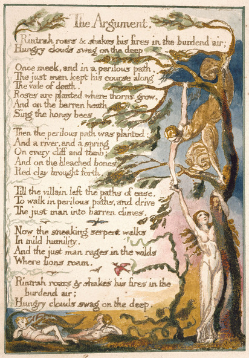

# Argumentet  
  

Rintrah brøler og ryster sin ild i tung luft,  
Sultne skyer svajer i det dybe.  
  
Engang sagtmodig og på en farefuld vej  
Den retfærdige mand holdt sin kurs  
langs Dødens dal.  
Roser er plantet hvor torne vokser,  
Og på den golde hede  
Synger honningbierne.  
  
Herefter blev den farefulde sti plantet,  
Og en flod og et forår  
På alle klipper og grave;  
Og på de blegede knogler  
Rødt ler sprang frem:  
Indtil skurken forlod lethedens sti  
For at gå på farefulde stier, og jage  
Den retfærdige mand mod golde himmelstrøg.  
  
Nu går den snigende slange  
I mild ydmyghed;  
Og den retfærdige mand raser i det vilde  
Hvor løver strejfer omkring.  
  
Rintrah brøler og ryster sin ild i tung luft,  
Sultne skyer svajer i det dybe.  
  
Og imens en ny himmel er opstået, det er nu 33 år siden dens fremkomst, så genoplives det evige Helvede. Og se! Swedenborg er englen, som sidder ved graven: Hans skrifter er linnedklæderne, som er foldet op. Nu er kongedømmet Edom, og Adam er vendt tilbage til Paradis .-- Se Esajas XXXIV. og XXXV.  
  
Uden modsætninger er der ingen fremskridt. Tiltrækning og frastødning, fornuft og energi, kærlighed og had, er nødvendige for den menneskelige eksistens.  
  
Ud fra disse modsætninger opstår, hvad den religiøse kalder godt og ondt. Godt er det passive, der adlyder fornuften; Ondt er det, der uden kontrol springer frem fra energien.  
  
Godt er himlen, Ondt er helvede.  
  
# Djævlens Stemme  
  
Alle bibler eller hellige koder har følgende fejl:  
  
1. At mennesket har to principper for eksistens, d.v.s. krop og sjæl.  
  
2. At energi, kaldet ondt, alene tilhører kroppen; og at fornuften, kaldet godt, alene kommer fra sjælen.  
  
3. At Gud vil pine mennesket i al evighed for at følge sin energi.  
  
Men de følgende principper er sande:  
  
1. Mennesket har ikke en krop, der er adskilt for sjælen. For det, der kaldes kroppen, er en del af sjælen, der kan spores med de fem sanser, som er den primære metode til at erkende sjælen med i denne tidsalder.  
  
2. Energi er det eneste liv, og den kommer fra kroppen; fornuften er grænsen eller den ydre omkreds af energi.  
  
3. Energi er evig glæde.  
  
De, der modstår deres lyst, gør det fordi, at deres lyst er så svag, at den lader sig tæmme; og de, der tæmmer, eller tillader fornuften at sjæle lystens plads, beherkser lysten uvilligt.  
  
Og at lysten tæmmes betyder, at den efterhånden bliver passiv, indtil den kun er en skygge af lyst.  
  
Historien omkring dette er skrevet i "Det tabte paradis", og kongen af fornuft er kaldet Messias.  
  
Og den orginale ærkeengel eller behersker af energien er i den himmelske orden kaldet Djævlen eller Satan, og hans børn er kaldet synd og død.  
  
Men i Jobs bog er Miltons Messias kaldet Satan.  
  
For denne historie er blevet taget af begge hold.  
  
Det så ud til, for fornuften, at lysten blev kastet ud, men Djævlen siger, at det var Messias der faldt, og formede en himmel af det, som han fandt i dybet.  
  
Dette er vist i evangeliet, hvor han beder til Faderen om at sende trøst eller at give en lyst til at fornuften må få ideer at bygge på; Jehovah i biblen er ikke anden end ham, der dvæler i flammer. Vid at efter Kristus død, blev han Jehovah.  
  
Men i Milton er Faderen skæbnen, Sønnen er forholdet til sanserne og Helligånden er tomrum.  
  
Note. Grunden til at Milton skrev i lænker, når han skrev om engle og Gud, og fri, når han skrev om Djævle og helvede, skyldtes at han var en sand poet, og på Djævlens side uden at vide det.  
  
# En Mindeværdig Attrå  
  
Da jeg gik igennem helvedes flammer, opløftet af Åndens glæder, som for englene ligner pine og sindssyge, samlede jeg nogle ordsprog, og tænkte at en nations talemåder udtrykker dens karakter; så ordsprogene fra helvede udtrykker infernalsk visdom bedre end nogen beskrivelse af bygninger eller beklædningsgenstande.  
  
Da jeg kom hjem, til dybet af de fem sanser, hvor en flad side skarpt rejste sig over den nuværende verden, så jeg en mægtig Dæmon samlet i mørke skyer, der svævede over klippens sider; med tærrende flammer skrev han følgende sætning, erkendt af menneskets sind, og nu læst på jorden:  
  
"Hvordan kan du vide, at hver fugl  
der skærer luftige veje  
Er en enorm verden af glæde,  
lukket af jeres sansers fem?"  
  
# Helvedes Ordsprog  
  
Lær i så-tiden, undervis når der høstes, og glæd dig om vinteren.  
  
Kør din vogn og din plov over knoglerne af de døde.  
  
Overskridelsens vej fører til visdommens palads.  
  
Fornuften er en rig gammel kælling bejlet af manglende evner.  
  
Ham der ønsker, men ikke handler, avler pest.  
  
Den overskårne orm tilgiver ploven.  
  
Dyp ham i floden, der elsker vand.  
  
En tåbe ser ikke det samme træ som en vismand ser.  
  
Han, hvis ansigt ikke lyser, skal aldrig blive en stjerne.  
  
Evigheden er forelsket i fremstillingen af tid.  
  
Den flittige bi har ikke tid til sorg.  
  
Dårskabens timer kan måles på uret, men vidom kan intet ur måle.  
  
Al sund mad er fanget uden et net eller en fælde.  
  
Bring frem nummer, vægt og mål i et år med mangel.  
  
Ingen fugl svæver for højt, hvis den svæver på sine egne vinger.  
  
En død krop hævner ikke sine skader.  
  
Den mest sublime handling er at sætte en anden før dig.  
  
Hvis en tåbe var udholden i sin tåbelighed, ville han blive vis.  
  
Tåbelighed er slynglens kappe.  
  
Skam er stolthedens kappe.  
  
Fængsler er bygget af sten af love, bordeller er bygget med sten af religion.  
  
Påfuglens stolthed er Guds herlighed.  
  
Gedens begær er Guds dusør.  
  
Løvens vrede er Guds visdom.  
  
Kvindens nøgenhed er Guds arbejde.  
  
For meget sorg griner, for meget glæde græder.  
  
Løvens brøl, ulvens hyl, det stormende havs vrede, og destruktionens sværd er dele af evigheden, som er for mægtige for menneskets øje.  
  
Ræven fordømmer fælden og ikke ham selv.  
  
Glæde befrugter, sorg føder.  
  
Lad manden bære løvens skind, kvinden fårets.  
  
Fulgen en rede, edderkoppen et spind, mennesket venskab.  
  
Den selviske smilende tåbe og den skullende og frådende tåbe skal vi tro kloge, så de må blive en støtte.  
  
Rotten, mussen, ræven, haren holder øje med rødderne; løven, tigeren hesten, elefanten holder øje med frugterne.  
  
Det der nu er bevist var engang kun en fantasi.  
  
Cisternen indeholder springvandet flyder over.  
  
En tanke fylder umådeligt.  
  
Vær altid klar til at sige din mening, og et kælder menneske vil undgå dig.  
  
Alt, der er muligt, som vi kan tro, er et billede af sandheden.  
  
Ørnen mistede aldrig så meget tid, som da han forsøgte at lære af kragen.  
  
Ræven klarer sig selv, men Gud sørger for løven.  
  
Tænk om morgenen, handel om middagen, spis om aftenen og sov om natten.  
  
Ham det har tvunget dig til pine, kender dig.  
  
Som ploven følger ord, belønner Gud bønner.  
  
Tigeren i vrede er mere intelligent end den tæmmede hest.  
  
Forvent gift fra stilstående vand.  
  
Du ved ikke, hvad der er rigeligt, med mindre du ved, hvad der er mere end rigeligt.  
  
Lyt til tåbens bebrejdelser; det er en kongelig titel.  
  
Øjnene af ild, næseborene af luft, munden af vand, jorden af skæg.  
  
De svage i mod er stærke i list.  
  
Æbletræet spørger ikke bøgen, hvordan den skal gro, og løven spørger ikke hesten, hvordan han skal fange sit bytte.  
  
Den taknemmelige modtager får en stor høst.  
  
Hvis ikke andre var tåbelige, så skulle vi være det.  
  
Sjælen med sød glæde kan aldrig blive besmittet.  
  
Når du ser en ørn, da ser du en del af en ånd. Løft dit hoved!  
  
Larven vælger de grønneste blade at lægge sine æg på, ligesom præsten lægger sin forbandelser på de sødeste glæder.  
  
At skabe en lille blomst er tidsaldres arbejde.  
  
Forband seler; velsign afslapning.  
  
Den bedste vin er den ældste, det bedste vand det mest friske.  
  
Bønner pløjer ikke; lovprisninger høster ej; glæde griner ikke; sorg græder ej.  
  
Hovedet det sublime, hjertet patos, kønnet skønhed, hænder og fødder proportion.  
  
Som luften er for fuglen, er havet for fisken, således er foragt til det foragtelige.  
  
Kragen ønsker at alt er sort, uglen at alt er hvidt.  
  
Fuld af energi er skønhed.  
  
Hvis løven fik råd af ræven, ville han være snu.  
  
Forbedring gør veje lige, men krogede veje uden forbedring er åndens veje.  
  
Det er bedre at myrde et spædbarn i vuggen end at pleje begær uden handling.  
  
Hvor mennesket ikke er , er naturen ufrugtbar.  
  
Sandheden kan aldrig blive fortalt for at blive forstået og ikke troet.  
  
Rigeligt! Eller for meget.  
  
Oldtidens poeter animerede alle mulige praktiske objekter med guder og ånder, og hyldede dem med navne og genstande fra skovene, floderne, søerne, byerne, nationerne, eller hvad deres forstærkede og talrige sanser kunne opfatte. Og i særdeleshed studerede de enhver by og lands ånder, og placerede dem under mentale guddomme. Indtil et system blev formet, som tog fordel af og trælbandt det direkte og simple (vulgære) ved at abstrahere mentale guder fra objekterne. Da begyndte præsteskabet. De valgte former for tilbedelse ud fra poetiske fortællinger. Og med tiden annoncerede de at Guderne havde beordret dem til disse tin. Således glemte mennesket at alle Guder bor i hans bryst.  
  
### En mindeværdig attrå  
  
Profeterne Esajas og Ezekiel spiste med mig, og jeg spurgte dem, hvordan de eftertrykkeligt turde hævde at Gud talte til dem, og om de ikke tænkte, at de ville blive misforstået, og derved blive årsag til en byrde.  
  
Esajas svarede: "Jeg så ingen Gud, og jeg hørte ingen, i en endelig organisk opfattelse: Men mine sanser opdagede en uendelighed i alle ting; og da blev jeg overtalt, og forblev i overbevisningen om, at stemmen af retfærdig harme er Guds stemme. Jeg bekymrede mig ikke om konsekvenserne, men skrev.  
  
Så spurgte jeg: "Gør en klar overbevisning om en ting, at tingen er sådan."  
  
Han svarede: "Alle poeter tror, at den gør, og i fantasiens tidsalder kunne den faste overbevisning flytte bjerge; men mange er ikke i stand til at have en fast overbevisning om noget. "  
  
Så sagde Ezekel: "Filosofien fra østen trænede det første princip om den menneskelige perception; nogle nationer holdt et princip som oprindelse, og andre et andet. Vi fra Israel trænede, at den poetiske Ånd (som du nu kalder det) var det første princip, og at alle andre var afledt af dette; dette var årsagen til, at vi foragtede præster og filosoffer fra andre lande, og profeterede, at det skulle bevises, at alle guderne stammede fra vores, og var bifloder til den poetiske Ånd. Det var dette, som den store poet, kong David, eftertragtede så inderligt, og påkaldte sig så højstemt, gennem erobringer og styring af kongeriger; og vi elskede vores Gud så højt, at vi i hans navn forbandede de andre nationers guddomme, og hævdede, at de have gjort oprør. Ud fra disse holdninger tænkte de fleste, at alle nationer ville blive underlagt jøderne."  
  
"Dette," sagde han, "som med alle faste overbevisninger, er kommet til at ske, da alle nationer tror på jødernes kode, og tilbeder jødernes Gud; og hvilken større underkastelse kan eksistere?"  
  
Jeg hørte dette i forundring, og må erkende min egen overbevisning. Efter middagen spurgte jeg Esajas, om han ville give nogle af sine glemte værker ord til verden; han svarede, at ingen med samme værdi var gået tabt. Ezekel sagde det samme.  
  
Jeg spurgte ligeledes Esajas, hvad der fik ham til at gå nøgen og barfodet i tre år. Han svarede: "Det samme som skabte vor ven grækeren Diogenes."  
  
Så spurgte jeg Ezekel, hvorfor han spiste brød bagt over afføring, og hvorfor han lå så lang tid på den venstre og den højre side. Han svarede: "Lysten til at løfte mænd ind i en fornemmelse af det uendelige. De Nordamerikanske stammer praktiserer dette. Og er han ærlig, ham der modstår sin ånd og samvittighed, alene for den øjeblikkelige lethed eller tilfredsstillelses skyld?"  
  
***  
  
Den gamle tradition, at verden vil blive opslugt af flammer efter sekstusinde år er sand, som jeg har hørt fra helvede.  
  
For keruben med sit flammende svær er hermed befalet at forlade sin post ved livets træ, og når det sker, vil hele skabelsen blive fortærret og fremstå uendelig og hellig, hvor den nu fremstår endelig og korrupt.  
  
Dette vil ske ved en forøgelse af den sensuelle nydelse.  
  
Men først må antagelsen om, at mennesket har en krop, der adskiller sig fra sjælen, udslettes; dette vil jeg gøre ved at udskrive den infernalske metode med ætsende substanser, som i Helvede er gavnlig og medicinsk, som smelter bort tilsyneladende overflader, og viser det uendelige, som var skjult.  
  
Hvis sansernes døre blev renset, så ville alt fremstå for mennesket, som det er, uendeligt.  
  
For mennesket har lukket sig inde, indtil han ser alle tingene igennem smalle sprækker i hans hule.  
  
# En mindeværdig attrå  
  
Jeg var i et trykkeri i Helvede, og jeg så den metode, hvormed viden gives videre fra en generation til en anden. 

I det første rum var der en drage-man, der fjernede alt affald fra en hules mund, et antal drager uddybede hulen. 

I det andet rum der en giftig slange, som foldede sig omkring stenen i hulen, og andre prydede den med guld, sølv og dyrebare sten.

I det tredie rum var der en ørn med vinger og fjer af luft og hulen; han bevirkede at det indvendige af hulen var uendeligt; rundt omkring var der ørne-mæn, der byggede paladser i de enorme klipper. 

I det fjerde kammer var der løver af flammende ild, som rasede rundt og smeltede metallet til en levende strøm. 

I det femte kammer var det former uden navn, som kastede metaller ud i et område. 

Der blev de modtaget af mænd, som var i det sjette kammer, og antog form af bøger, som blev arrangeret i biblioteker.

***

Giganterne som formede denne verden og dens senselle eksistens og nu synes at leve i den i kæder er i sandhed årsagen til verdens liv and kilden til al aktivitet, men kæderne er en list udtænkt af svage og tamme sind, som har magt til at modstå energi, i henhld til ordsproget: "De svage i mod er stærke i list."

Således er en del af væren skabende, den anden fortærende. For fortæreren synes det som om, at skaberen er i hans lænker; men det er ikke sådan; han tager kun portioner af eksistensen, og fantaserer om det hele.

Men skaberen ville ophøre med at være skaber, hvis ikke fortæreren som et hav modtag overskuddet af glæderne.

Nogle ville sige, "Er Gud ikke alene skaberen?" Jeg svarer: "Gud handler kun og er i sin eksistens væsener eller mennesker." 

Disse to klasser af mænd er altid på jorden, og de skal være fjender: Dem der prøver at forlige dem, søger at ødelægge eksistensen.

Religion er et forsøg på at forlige de to.

Note. Jesus Kristus ønskede ikke at forene, men at adskille disse to, som i  lignelsen om fårene og bukkene; og Han sagde: "Jeg kom ikke for at bringe fred, men sværd."

Messias, eller Satan, eller fristeren, var tidligere regnet for at være en fra før syndefaldet, som er vores Energier. 

# En mindeværdig attrå 

En engel kom til mig og sagde: "O stakkelse tåbelige unge mand! O forfærdlige, O rædselsfulde tilstand! Overvej den varme brændende hule, som du forbereder for dig selv i al evighed, hvor du vil gå med en sådan karriere."

Jeg sagde: "Måske er du villig til at vise mig mit evige lod, og vi kan sammen overveje det, og se hvorvidt dit eller mit lod, er det mest ønskværdige."

Så tog han mig gennem en stald, og gennem en kirke, og ned i kirke hvælvingen, hvor der stod en mølle; vi gik igennem møllen, og kom til en grotte; ned gennem den snoede grotte, hvor vi famlede en besværlig vej, indtil et grænseløst tomrum, som en himmel forneden, fremtrådte for os, og vi holdt ved i træernes rødder, og hang over denne uendelighed; men jeg sagde: "Hvis du ønsker det, så kan vi forpligte os til dette tomrum, og se om Beskytteren også er her; hvis du ikke vil, så vil jeg." Men han svarede: "Antag ikke, O unge mand; men hvis vi bliver her, se da alt, som snart vil fremstå, når mørket driver bort. "

Så jeg forblev sammen med ham, siddende i de skæve rødder af egetræet;  mens han hang i en svamp, som groede omvendt ned mod dybet.

Efterhånden så vi det uendelige dyb, fyrig som røg fra en brændende by; nedenfor i en umådelig distance var der sol, sort men skinnende; rundt om den flammende spor, hvorom der kredsede gigantiske edderkopper, kravlende efter deres bytte, som fløj, eller rettere svømmede, i det uendelige dyb, de mest forfærdelige former for dyr udsprunget af korruption; og luften var fyldt af dem, og syntes sammensat af dem. Disse er dæmoner, og kaldes magten over luften. Nu spurgte jeg min ledsager, hvad der var mit evige alt. Han svarede: "Mellem de sorte og hvide edderkopper." 

Men nu, mellem de sorte og hvide edderkopper, splittedes en sky og ild brød løs og rullede i dybet, mørklagde alt forneden, så det nedre dyb voksede sig sort som et hav, og rullede med en frygtelig larm. Forneden var der nu ikke noget at se ud over en sort storm, indtil vi så, mod øst, mellem skyerne og bølgerne, et vandfald af blod og ild, og ikke mange stenkast borte fra os fremstod og forsvandt de skællede foldninger af en uhyrlig slange. Til sidst, mod øst, omkring tre gange så langt borte, opstod en brændende skorpe oven på bølgerne; langsomt løftes en ryg af gyldne sten, indtil vi så to glober af blodrød ild, hvorfra havet flygtede bort i skyer af røg; og nu så vi hovedet på Leviathan. Hans pande var delt i striber af grøn og lilla, ligesom dem på en tigers pande; snart så vi hans mund og røde gæller, der hang lige over det frådende skum, splittende det sorte dyb med stråler af blod, fremrykkende imod os med en spirituel eksistens' raseri.

Min ven Englen kravlede fra hans plads ind i møllen. I forblev alene tilbage, og så ophørte denne fremtrædelse. Men jeg fandt mig selv siddende på en behagelig bred ved en flod under måneskin, mens jeg hørte en, der spillede harpe, og temaet var: "Manden som aldrig ændrer sine meninger, er som stilstående vand, og avler sindets reptiler."

Men jeg rejste mig og søgte efter møllen, hvor jeg fandt Englen. som overrasket spurgte mig, hvordan jeg var undsluppet. 

Jeg svarede: "Alt hvad vi så, skylder vi vor egen metafysik; for da du løb væk, opdagede jeg en bred under månelys, mens jeg hørte en, der spillede harpe. Men nu har vi set mit evige Alt, skal vi nu se dit?" Han lo af mit forslag, men jeg greb ham med magt i mine arme, og fløj mod vest gennem natten, indtil vi svævede over jordens skygge; og så kastede jeg mig selv og ham direkte ind i solen; her klædte jeg mig selv i hvidt, og tog Swedenborgs bøger i hånden, og sank fra det herlige himmelstrøg, passerede planeterne indtil vi nåede Saturn. Her standsede jeg for at hvile, og sprang så ud i tomrummet mellem Saturn og stjernerne. 

"Her, " sagde jeg, "er mit alt; i dette rum, hvis jeg må kalde det rum. " Snart så vi stalden og kirken, og jeg tog ham med til alteret og åbnede biblen, og se! den var et dybt hul, hvor jeg steg ned, og skubbede Englen foran mig. Snart så vi syv huse af sten. Vi gik ind i det ene. Derinde var der et antal aber, bavianer, og andre abearter, fastbundne i midten, hvor de grinte af og kradsede de andre, men holdt fast af korte kæder. Nogle gange voksede de i antal, og da blev de svage fanget af de stærke, og med et grinnende udtryk blev de først fastholdt og dernæst fortærret ved at plukke lemmerne af et efter et indtil kroppen var en hjælpeløs kasse; og denne, efter at have grinnet af og kysset den, blev ligeledes fortærret. Og her og der så jeg en enkelt, der med appetit plukkede kødet af sin egen hale. Stanken var rædselsfuld og den irreterede os begge, og vi gik ind i møllen; og  min hånd bar jeg skelet fra en krop, som i møllen var Aristoteles 'Analysen'. 

Da sagde Englen: "Din fantasi har du pålagt mig, og du burde skamme dig."

Jeg svarede: "Vi pålægger alle på hinanden, og det er kun tabt tid af samtale med dig, hvis arbejde kun er 'Analyse'. 

***

"Jeg har fundet at Englene har forfængeligheden til at tale om sig selv, som om de er de eneste kloge; dette gør de med sikker uforskammethed, som spirer fra systematisk tænkning."

"Derfor praler Swedenborg med, at det han skriver er nyt, selvom det kun er indhold eller indekser af allerede udgivne bøger."

"En mand tog en abe med til en forestilling, og fordi han kun var en smule mere intelligent end aben, blev han forfængelig, og opfattede sig selv som mere vis end syv mænd. Sådan er det med Swedenborg; han viser det tåbelige ved kirker og afslører hyklere, indtil han forestiller sig at alle er religiøse, og at det kun er ham, som nogensinde er brudt ud af nettet. "

"Nu skal du høre en sandhed: Swedenborg har aldrig skrevet en eneste sandhed. Nu skal du høre en anden: Han har skrevet gamle usandheder."

"Og nu skal du høre grunden dertil: Han konverserede med Engle, som alle er religiøse, og han konverserede ikke med Dæmoner, som alle hader religion, for dette var han ikke i stand til på grund af hans forfængelige forestillinger."

"Således er Swedenborgs en sammenfatning af alle overfladiske udtalelser, samt en analyse af de mere sublime, men ikke mere end det."

"Her er en anden sandhed: Enhver mand af mekanisk talent kan ud fra Paracelsus eller Jacob Behmens skrifter producere titusinde bøger af samme værdi som Swedenborgs, og fra Dante eller Shakespeare et uendeligt antal."

"Men når han har gjort det, lad ham da ikke sige, at han ved bedre end sin mester, for han holder kun et lys i solskin."

# En mindeværdig attrå

Engang så jeg en Djævel i en flamme af ild. som rejste sig foran en Engel, som sad på en sky, og Djævlen sagde disse ord: "Tilbedelsen af Gud er, at tilbede Guds evner i andre mænd i forhold til ånden i dem. Og at elske de største mænd mest. De som misunder eller bagvasker store mænd, hader Gud, for der er ingen anden Gud.

Englen, som hørte dette, blev næsten blå, men han beherskede sig selv og blev gul, og til sidste næsten som lys menneskehud. Han smilte, og svarede så: "Du afgudsdyrker, er Gud ikke een? Og er Han ikke synlig i Jesus Kristus? Og har Jesus Kristus ikke sanktioneret de ti bud? Og er alle mennesker ikke tåber, synder og ingenting?"

Djævlen svarede: "Knus en tåbe i en mortor med hvede; og alligevel vil hans tåbelighed ikke fare ud af ham. Hvis Jesus Kristus er det største menneske, så burde du elske Ham i den højste grad.  Hør nu, hvordan han sanktionerede de ti bud. Gjorde han ikke grin med sabbatten, og derved hånede han sabattens Gud? Myrdede dem, der blev myrdet på grund af Ham? Vende sig bort fra loven bort overfor kvinden, som bedrev hor? Stjæle andres arbejdskraft for at støtte Ham? Føre falsk vidensbyrd, da han undlod at føre noget forsvar overfor Pilatus? Begærede Han ikke, da Han bad for sine desciples liv, eller når Han bad dem om, at ryste støvet af deres fødder, hvis de ikke fik tilbudt logi? Jeg siger dig, ingen dyd kan eksisterer uden at bryde de ti bud. Jesus var ren dyd, og handlede fra impuls, og ikke fra fra regler."

Da han havde talt, kiggede Jeg på Englen, som trakte sine arme ud og omfavnede flammen af ild, og han brændte bort, og steg som Elias.

Note. Denne Engel, som nu er blevet en Djævel, er min særlige ven; vi læser ofte Biblen sammen i dens infernalske eller diabolske, som verden skal have, hvis de opfører sig godt. 

Jeg hhar ligeledes helveds bibel, som verden skal have uanset om de vil eller ej. 

En lov for løven og oksen er undertrykkelse. 

# Frihedens sang

1. Den evige kvinde stønnede; det blev hørt over hele jorden. 

2. Albions kyst er sygelig tavs; den amerikanske eng falmer. 

3. Skygger af profeti ryster langs søer og floder, og sniger sig langs havene,  Frankrig, riv ned dit fangekælder!

4. Gyldne Spanien, bryd det gamle Roms barrierer!

5. Smid nøglerne, O Rom, ned i dybet - faldende ned, endda ned til evigheden faldende;

6. Og græd!

7. I hendes rystende hænder tog hun den nyfødte rædsel, hylende.

8. På disse uendelige bjerge af lys, som er lukket ude af atlanterhavet, stod den nyfødte ild foran stjernernes konge. 

9. Markeret med gråt sne og tordnende udtryk, de jaloux vinger bølger over dybet.

10. Hånden med spydet brænder mod himlen; frigjort var skjoldet; frem sprang jalousiens hånd imellem det flammende hår, og hvivlede det nyfødte vidunder gennem den stjerneklare nat.

11. Ilden, ilden falder!

12. Se op! se op! O borger i London, åbn dit ansigt! O Jøde, hold inde med at tælle guld; vend tilbage til din olie og vin! O Afrika, sort Afrikaner! (Gå, vingede tanke, udvid panden.)

13. Gloende lemmer, flammende hår sendt som den synkende sol ned i det vestlige hav.

14. Vågnet fra hans evige søvn, det ældgamle element flygtede brølende væk.

15. Ned styrtede, slående sine vinger forgæves, den jaloux konge, det grå udtryk hos rådsmedlemmer, tordnende krigere, krøllede veteraner, blandt hjelme og skjolde, og vogne, heste, elefanter, bannere, slotte, slynger og klipper.

16. Faldende, farende, ødelæggernde; begravet i ruinerne af Urthonas huler.

17.  Hele natten under ruinerne; deres mutte flammer, falmede, stiger omkring den dystre konge.

18. Med torden og ild, der fører sine stjerneklare værter gennem den enorme vildmark, proklamerer han sine ti bud; skævende under vidt åbne øjenlåg, stirrer han ud over dybet med mørk utilfredshed.

19. Ildens Søn i hans østlige skyer, mens Morgens fjerpragten pryder hendes gyldne bryst,

20. Fremskynder skyer skrevet med forbandelser, knuser den stenede lov til støv, mister de evige heste fra nattens huler, grædende: "Imperiet er ikke mere! Og nu skal løven og ulven ophøre med at være."

# Kor

Præsterne fra Ravnenes Morgengry i dødelig sort: Lad dem ikke længere med hæs stemme forbande Glædens Sønner. Lad heller ikke deres brødre, som de kalder frie, men som er tyranner, binde og bygge taget. Lad heller ikke blege religiøse igler kalde det jomfrueligt, der ønsker, men ikke handler!

For alt hvad der lever er helligt. 
